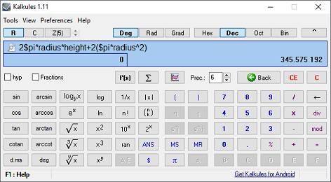

## Hi there 👋

<!--
**Jardo-51/jardo-51** is a ✨ _special_ ✨ repository because its `README.md` (this file) appears on your GitHub profile.

Here are some ideas to get you started:

- 🔭 I’m currently working on ...
- 🌱 I’m currently learning ...
- 👯 I’m looking to collaborate on ...
- 🤔 I’m looking for help with ...
- 💬 Ask me about ...
- 📫 How to reach me: ...
- 😄 Pronouns: ...
- ⚡ Fun fact: ...
-->

I've been writing code since 2005, professionally since 2010. I'm always striving to improve and learn something new.

## My Public Work

### Kalkules

<https://www.kalkules.com/>

A scientific calculator with many non-traditional tools.

- 22k monthly downloads
- Translated into 15 languages (long before Chat GPT existed)
- Featured in several PC publications such as [TrishTech.com](https://www.trishtech.com/2015/10/kalkules-alternative-calculator-for-windows-pc/), [Živě.cz](https://www.zive.cz/clanky/kalkules-kalkulacka-pro-opravdove-matematicke-geeky/sc-3-a-170163/default.aspx), [PCLife.cz](http://www.pclife.cz/1564-kalkules-nabizi-mnohem-vice-nez-nahradu-kalkulacky-ve-windows/)

### Maven Flow

A collection of CI tools for solving common problems faced by teams developing software in Java with Maven using [Git Flow](https://nvie.com/posts/a-successful-git-branching-model/).

- [maven-flow/merge](https://github.com/marketplace/actions/maven-flow-merge): A Github action for merging branches with automatic conflict resolution in changelog and `pom.xml` files.

- [maven-flow/prevent-artifact-overwrites](https://github.com/marketplace/actions/prevent-maven-artifact-overwrites) A Github action for preventing overwrites of Maven artifact versions from different feature branches.

### Changelog Merge Driver

<https://github.com/maven-flow/changelog-merge-driver>

A GIT merge driver for changelog files, which prevents conflicts when merging feature branches.

Technically a part of Maven Flow, but it can also be used locally as any other GIT merge driver.

### Reactive Feign

<https://github.com/Jardo-51/feign-reactive>

A reactive version of Feign - a popular Java framework for consuming REST APIs. Since the [original repo](https://github.com/PlaytikaOSS/feign-reactive) seems abandoned, I forked it, made it compatible with Spring Boot >= 3.2, and published the new version to [Maven Central](https://search.maven.org/artifact/com.jardoapps.reactivefeign/feign-reactor/4.1.0/jar?eh=).

